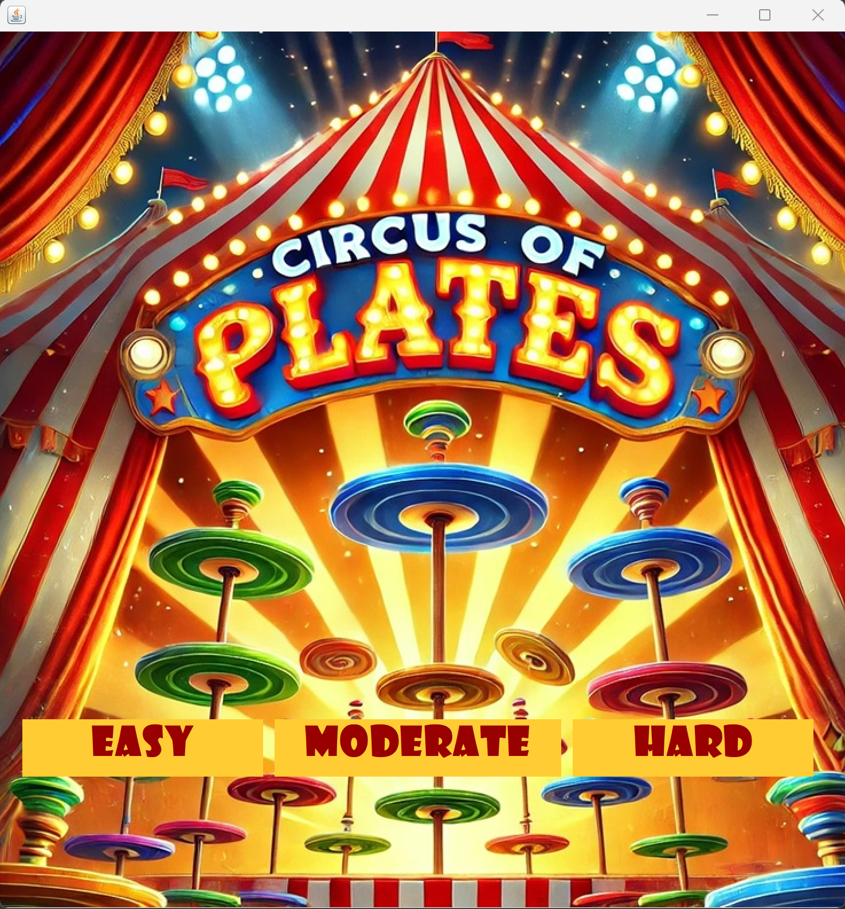
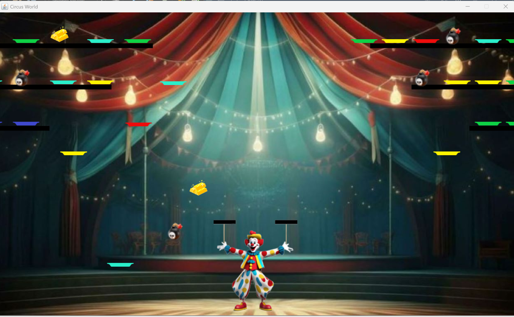
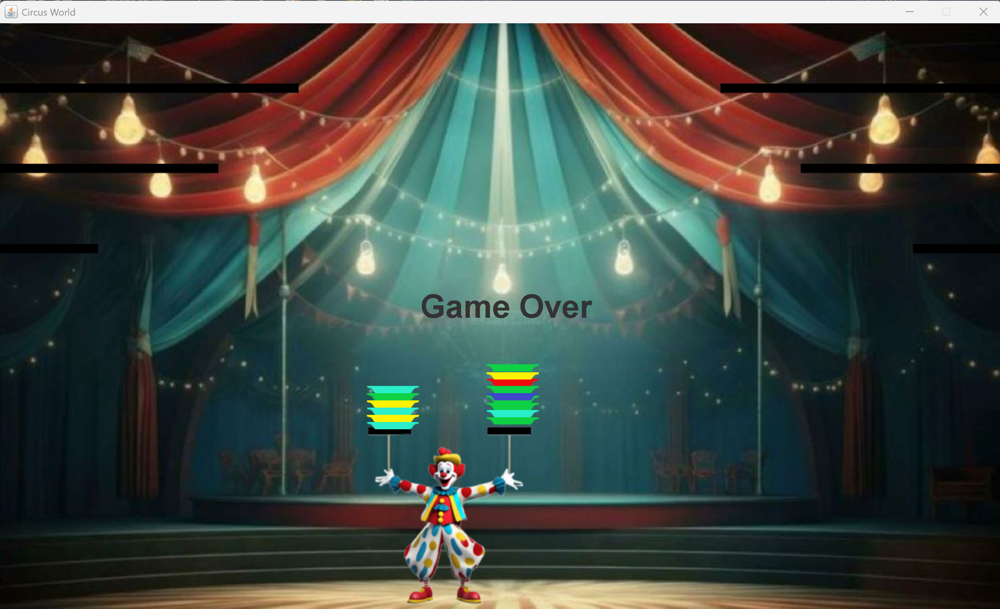

# Circus of Plates

A Java game where the player controls a clown that catches and stacks plates. Built using Java Swing and OOP principles.

## Features
- Multiple difficulty levels (Easy, Moderate, Hard)
- Game states: Start, Win, Lose
- Dynamic object handling using design patterns

## Screenshots

### Main Menu  

### Gameplay  

### Game Over  

## How to Run
Open the project in NetBeans and run the `final` class.

